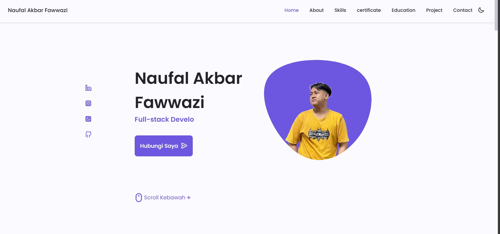
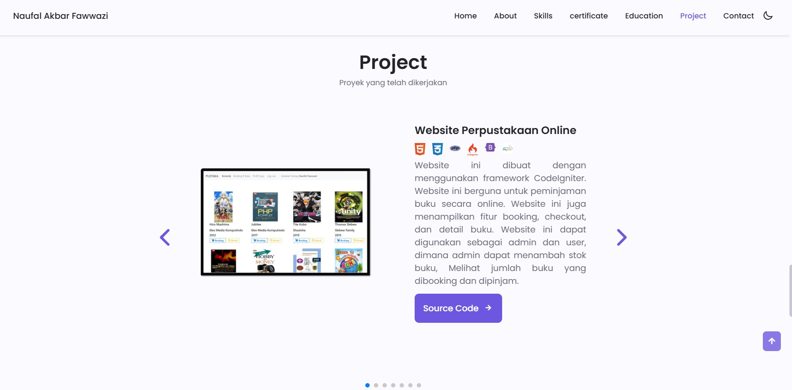
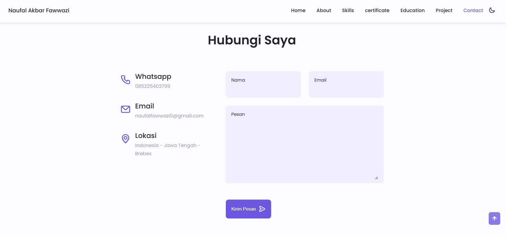

## Introduction 🚀
Hello 👋 welcome to my portfolio! This repository contains the source code for my personal portfolio website where I showcase my projects, skills, and experience.

## Features 🚀
- **Responsive Design**: Optimized for various screen sizes.
- **Project Showcase**: Display of my featured projects with descriptions and links.
- **About Me**: Information about my background, skills, and experience.
- **Contact Form**: A form to get in touch with me directly through the website.

## Technologies Used 🚀
- HTML5 & CSS3: For structuring and styling the web pages.
- JavaScript: For adding interactive features.
- Bootstrap: For building the user interface.

## Screenshoot 🚀
# Home Page 🖥️

# Project Page 🖥️

# Contact Page 🖥️

